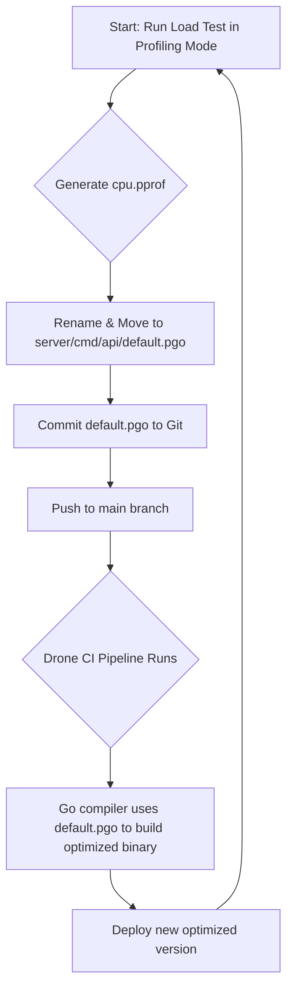

# Profile-Guided Optimization (PGO) Workflow Guide

## 1. What is Profile-Guided Optimization?

Profile-Guided Optimization (PGO) is a compiler optimization technique where the compiler uses performance data from a real application run to make more intelligent decisions about how to build the final binary. By understanding which parts of the code are used most frequently (the "hot paths"), the compiler can arrange the code for better speed and efficiency.

For our application, this means we can get a significant performance boost (typically 2-7%) by simply telling the Go compiler how we expect the application to be used in production.

## 2. The Production PGO Workflow

The process is a continuous cycle: you generate a performance profile from a production-like workload, commit it to the repository, and the CI/CD pipeline automatically uses it to build an optimized binary for the next deployment.



## 3. Step-by-Step Instructions

Here is the detailed process for updating your production application with a new performance profile.

### Step 1: Generate a High-Quality Profile

The quality of the optimization depends entirely on the quality of the profile. The workload you run during profiling should be as close to your real production traffic as possible.

1.  **Start your development environment:** Run `tilt up` as you normally would.
2.  **Trigger Profiling Mode:** In the Tilt web UI, find the resource named `server-6-profile` and click the **trigger** button (the small play icon).
    *   This starts a *new*, temporary server instance with CPU profiling enabled. All traffic for the load test should be directed to this instance.
3.  **Run Your Load Test:** Execute your performance test suite against the profiling server. Ensure the test runs long enough to capture a representative sample of application behavior (a few minutes is usually sufficient).
4.  **Stop Profiling:** When the load test is complete, stop the `server-6-profile` resource in the Tilt UI. This will gracefully shut down the profiling server.
5.  **Locate the Profile:** A new file named `cpu.pprof` will now be present in your `server/` directory.

### Step 2: Prepare and Commit the Profile

The Go compiler automatically looks for a file named `default.pgo` in the main package's directory.

1.  **Move and Rename the Profile:** From your project root directory, run the following command:

    ```bash
    mv server/cpu.pprof server/cmd/api/default.pgo
    ```

2.  **Commit to Git:** Add and commit the new profile to your Git repository. This is the official performance profile for the upcoming build.

    ```bash
    git add server/cmd/api/default.pgo
    git commit -m "feat(server): update PGO profile for performance tuning"
    ```

### Step 3: Push and Deploy

Once the `default.pgo` file is committed, the rest of the process is fully automated.

1.  **Push to Main:** Push your commit to the `main` branch.
2.  **Automatic Build:** This will trigger the `build` pipeline in Drone. The `build-backend` step is now configured to use the `-pgo` flag, so the Go compiler will find your committed `default.pgo` file and use it to build the optimized binary.
3.  **Automatic Deploy:** The subsequent `deploy` pipeline will deploy the new, PGO-optimized version of the application.

## 4. Maintaining the Profile

A PGO profile is a snapshot of your application's performance at a specific point in time. You should plan to regenerate it periodically.

**When to generate a new profile:**

*   **After significant code changes:** If you add major new features or refactor critical parts of the application, the old profile may no longer be accurate.
*   **After shifts in traffic patterns:** If you anticipate that users will interact with the application differently, a new profile will capture this new behavior.

A good practice is to regenerate the profile every 1-3 months or after any major release.
