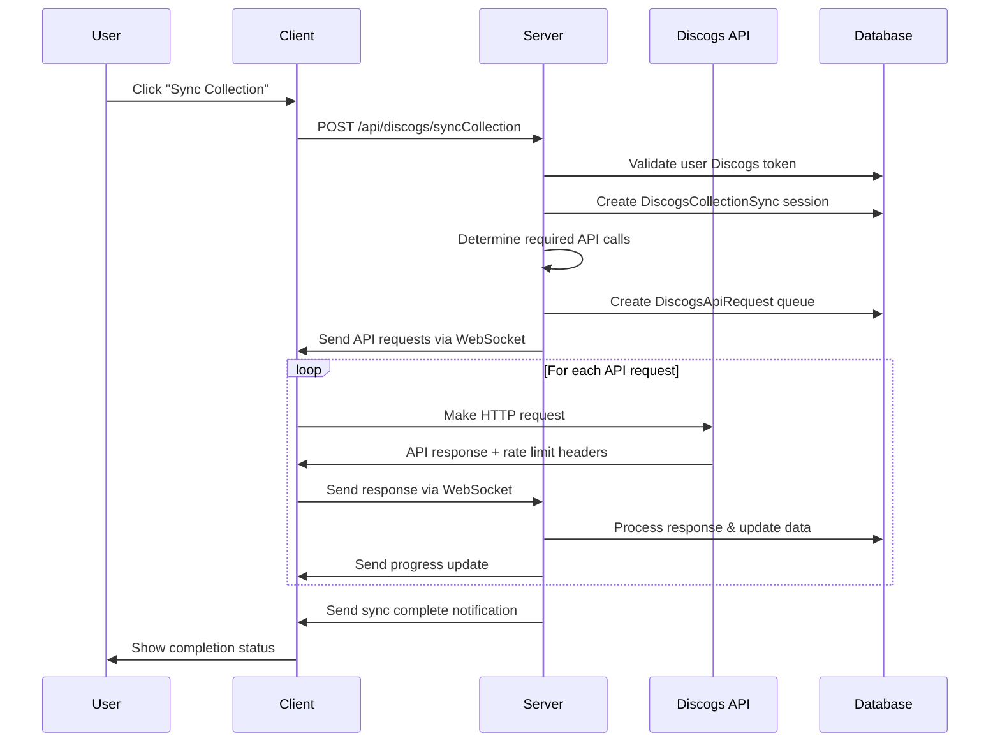
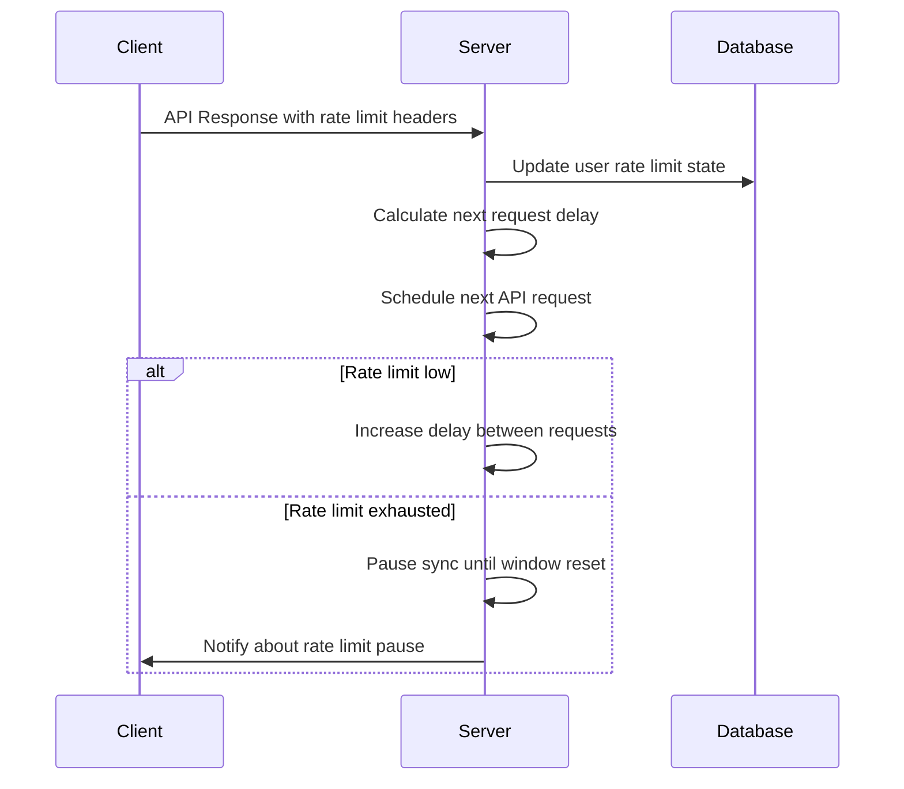

# Discogs API Proxy System Architecture

## Overview

The Discogs API Proxy System implements a **client-as-proxy pattern** where the server orchestrates Discogs API synchronization workflows while clients make the actual HTTP requests. This architecture distributes rate limits across users while maintaining server control over complex sync logic and state management.

## Architecture Pattern: Client-as-Proxy

### Core Concept

```
User Request → Server (Orchestration) → Client (Proxy) → Discogs API
                ↑                        ↓
              WebSocket ←------------------ Response
                ↓
            Database Update & Progress Tracking
```

### Key Benefits

1. **Distributed Rate Limits**: Each user's client uses their own Discogs API rate limit quota
2. **Server Control**: Server manages complex sync logic, state persistence, and business rules
3. **Real-time Communication**: WebSocket enables immediate progress updates and error handling
4. **Scalability**: Naturally scales with user count without server-side rate limit bottlenecks
5. **Resilience**: Can handle disconnections, partial syncs, and resume operations

## Technical Components

### Backend Infrastructure

#### New Models & Repositories

**DiscogsApiRequest Model** (`internal/models/discogsApiRequest.model.go`):
```go
type DiscogsApiRequest struct {
    BaseUUIDModel
    UserID          uuid.UUID `gorm:"type:uuid;not null;index"`
    SyncSessionID   uuid.UUID `gorm:"type:uuid;not null;index"`
    RequestID       string    `gorm:"type:text;not null;uniqueIndex"`
    URL             string    `gorm:"type:text;not null"`
    Method          string    `gorm:"type:text;not null;default:'GET'"`
    Headers         datatypes.JSON `gorm:"type:jsonb"`
    Status          RequestStatus  `gorm:"type:text;default:'pending'"`
    RetryCount      int       `gorm:"type:int;default:0"`
    ResponseStatus  *int      `gorm:"type:int"`
    ResponseHeaders datatypes.JSON `gorm:"type:jsonb"`
    ResponseBody    datatypes.JSON `gorm:"type:jsonb"`
    ErrorMessage    *string   `gorm:"type:text"`
}

type RequestStatus string
const (
    RequestStatusPending    RequestStatus = "pending"
    RequestStatusSent       RequestStatus = "sent"
    RequestStatusCompleted  RequestStatus = "completed"
    RequestStatusFailed     RequestStatus = "failed"
    RequestStatusRetrying   RequestStatus = "retrying"
)
```

**DiscogsCollectionSync Model** (`internal/models/discogsCollectionSync.model.go`):
```go
type DiscogsCollectionSync struct {
    BaseUUIDModel
    UserID            uuid.UUID `gorm:"type:uuid;not null;index"`
    SessionID         string    `gorm:"type:text;not null;uniqueIndex"`
    Status            SyncStatus `gorm:"type:text;default:'initiated'"`
    TotalRequests     int       `gorm:"type:int;default:0"`
    CompletedRequests int       `gorm:"type:int;default:0"`
    FailedRequests    int       `gorm:"type:int;default:0"`
    StartedAt         time.Time `gorm:"autoCreateTime"`
    CompletedAt       *time.Time `gorm:"type:timestamp"`
    ErrorMessage      *string   `gorm:"type:text"`
    SyncType          string    `gorm:"type:text;not null"` // "collection", "wantlist"
    LastPage          *int      `gorm:"type:int"`
    TotalPages        *int      `gorm:"type:int"`

    // Relationships
    User        *User                `gorm:"foreignKey:UserID"`
    ApiRequests []DiscogsApiRequest  `gorm:"foreignKey:SyncSessionID;references:ID"`
}

type SyncStatus string
const (
    SyncStatusInitiated  SyncStatus = "initiated"
    SyncStatusInProgress SyncStatus = "in_progress"
    SyncStatusCompleted  SyncStatus = "completed"
    SyncStatusFailed     SyncStatus = "failed"
    SyncStatusCancelled  SyncStatus = "cancelled"
)
```

#### New Services

**DiscogsOrchestrationService** (`internal/services/discogsOrchestration.service.go`):
```go
type DiscogsOrchestrationService interface {
    InitiateCollectionSync(ctx context.Context, userID uuid.UUID) (*DiscogsCollectionSync, error)
    CreateApiRequestQueue(ctx context.Context, syncSession *DiscogsCollectionSync) error
    ProcessApiResponse(ctx context.Context, requestID string, response *ApiResponse) error
    GetSyncProgress(ctx context.Context, sessionID string) (*SyncProgress, error)
    CancelSync(ctx context.Context, sessionID string) error
}

type ApiResponse struct {
    RequestID       string            `json:"requestId"`
    Status          int               `json:"status"`
    Headers         map[string]string `json:"headers"`
    Body            json.RawMessage   `json:"body"`
    Error           *string           `json:"error,omitempty"`
}

type SyncProgress struct {
    SessionID         string    `json:"sessionId"`
    Status            string    `json:"status"`
    TotalRequests     int       `json:"totalRequests"`
    CompletedRequests int       `json:"completedRequests"`
    FailedRequests    int       `json:"failedRequests"`
    PercentComplete   float64   `json:"percentComplete"`
    EstimatedTimeLeft *string   `json:"estimatedTimeLeft,omitempty"`
}
```

**DiscogsRateLimitService** (`internal/services/discogsRateLimit.service.go`):
```go
type DiscogsRateLimitService interface {
    UpdateRateLimit(ctx context.Context, userID uuid.UUID, headers map[string]string) error
    GetRateLimit(ctx context.Context, userID uuid.UUID) (*RateLimit, error)
    CanMakeRequest(ctx context.Context, userID uuid.UUID) (bool, time.Duration, error)
    CalculateRequestDelay(ctx context.Context, userID uuid.UUID) time.Duration
}

type RateLimit struct {
    UserID           uuid.UUID `json:"userId"`
    Remaining        int       `json:"remaining"`
    Limit            int       `json:"limit"`
    WindowReset      time.Time `json:"windowReset"`
    LastUpdated      time.Time `json:"lastUpdated"`
    RecommendedDelay time.Duration `json:"recommendedDelay"`
}
```

#### Enhanced WebSocket Manager

**New Message Types** (add to `internal/websockets/websocket.go`):
```go
const (
    // Existing types...
    MESSAGE_TYPE_DISCOGS_API_REQUEST  = "discogs_api_request"
    MESSAGE_TYPE_DISCOGS_API_RESPONSE = "discogs_api_response"
    MESSAGE_TYPE_SYNC_PROGRESS        = "sync_progress"
    MESSAGE_TYPE_SYNC_COMPLETE        = "sync_complete"
    MESSAGE_TYPE_SYNC_ERROR           = "sync_error"
)
```

### Frontend Infrastructure

#### New Services

**DiscogsApiService** (`src/services/discogs/discogsApi.service.ts`):
```typescript
export interface DiscogsApiRequest {
  requestId: string;
  url: string;
  method: string;
  headers: Record<string, string>;
}

export interface DiscogsApiResponse {
  requestId: string;
  status: number;
  headers: Record<string, string>;
  body: any;
  error?: string;
}

export class DiscogsApiService {
  async makeRequest(request: DiscogsApiRequest): Promise<DiscogsApiResponse> {
    // Make actual HTTP request to Discogs API
    // Extract rate limit headers
    // Return structured response
  }

  private extractRateLimitHeaders(headers: Headers): Record<string, string> {
    // Extract X-Discogs-Ratelimit-* headers
  }
}
```

**DiscogsProxyService** (`src/services/discogs/discogsProxy.service.ts`):
```typescript
export class DiscogsProxyService {
  constructor(
    private webSocket: WebSocketContextValue,
    private apiService: DiscogsApiService
  ) {}

  initializeProxyHandlers(): void {
    // Set up WebSocket message handlers for API requests
    this.webSocket.onMessage(MESSAGE_TYPE_DISCOGS_API_REQUEST, this.handleApiRequest);
  }

  private async handleApiRequest(message: WebSocketMessage): Promise<void> {
    // Receive API request from server
    // Make actual Discogs API call
    // Send response back via WebSocket
  }

  async initiateCollectionSync(): Promise<void> {
    // Call REST endpoint to start sync
    // Set up progress tracking
  }
}
```

## Implementation Flow

### 1. Sync Initiation Flow



### 2. Rate Limit Management Flow



## WebSocket Message Protocols

### Server → Client: API Request

```typescript
{
  id: "uuid",
  type: "discogs_api_request",
  channel: "sync",
  action: "make_request",
  data: {
    requestId: "req_uuid",
    url: "https://api.discogs.com/users/{username}/collection?page=1",
    method: "GET",
    headers: {
      "Authorization": "Discogs token=user_token_here",
      "User-Agent": "Waugzee/1.0"
    }
  },
  timestamp: "2025-01-20T10:30:00Z"
}
```

### Client → Server: API Response

```typescript
{
  id: "uuid",
  type: "discogs_api_response",
  channel: "sync",
  action: "request_complete",
  data: {
    requestId: "req_uuid",
    status: 200,
    headers: {
      "x-discogs-ratelimit-remaining": "55",
      "x-discogs-ratelimit-limit": "60",
      "x-discogs-ratelimit-window": "60"
    },
    body: {
      "pagination": { "page": 1, "pages": 12, "per_page": 50 },
      "releases": [/* release data */]
    }
  },
  timestamp: "2025-01-20T10:30:02Z"
}
```

### Server → Client: Progress Update

```typescript
{
  id: "uuid",
  type: "sync_progress",
  channel: "sync",
  action: "progress_update",
  data: {
    sessionId: "sync_session_uuid",
    status: "in_progress",
    totalRequests: 12,
    completedRequests: 5,
    failedRequests: 0,
    percentComplete: 41.67,
    estimatedTimeLeft: "7 minutes",
    currentAction: "Processing page 6 of 12"
  },
  timestamp: "2025-01-20T10:35:00Z"
}
```

## Database Schema Changes

### New Tables

**discogs_api_requests**:
```sql
CREATE TABLE discogs_api_requests (
    id UUID PRIMARY KEY DEFAULT uuid7(),
    user_id UUID NOT NULL REFERENCES users(id),
    sync_session_id UUID NOT NULL,
    request_id TEXT NOT NULL UNIQUE,
    url TEXT NOT NULL,
    method TEXT NOT NULL DEFAULT 'GET',
    headers JSONB,
    status TEXT NOT NULL DEFAULT 'pending',
    retry_count INTEGER DEFAULT 0,
    response_status INTEGER,
    response_headers JSONB,
    response_body JSONB,
    error_message TEXT,
    created_at TIMESTAMP DEFAULT NOW(),
    updated_at TIMESTAMP DEFAULT NOW()
);

CREATE INDEX idx_discogs_api_requests_user_id ON discogs_api_requests(user_id);
CREATE INDEX idx_discogs_api_requests_sync_session ON discogs_api_requests(sync_session_id);
CREATE INDEX idx_discogs_api_requests_status ON discogs_api_requests(status);
```

**discogs_collection_syncs**:
```sql
CREATE TABLE discogs_collection_syncs (
    id UUID PRIMARY KEY DEFAULT uuid7(),
    user_id UUID NOT NULL REFERENCES users(id),
    session_id TEXT NOT NULL UNIQUE,
    status TEXT NOT NULL DEFAULT 'initiated',
    total_requests INTEGER DEFAULT 0,
    completed_requests INTEGER DEFAULT 0,
    failed_requests INTEGER DEFAULT 0,
    started_at TIMESTAMP DEFAULT NOW(),
    completed_at TIMESTAMP,
    error_message TEXT,
    sync_type TEXT NOT NULL,
    last_page INTEGER,
    total_pages INTEGER,
    created_at TIMESTAMP DEFAULT NOW(),
    updated_at TIMESTAMP DEFAULT NOW()
);

CREATE INDEX idx_discogs_collection_syncs_user_id ON discogs_collection_syncs(user_id);
CREATE INDEX idx_discogs_collection_syncs_session_id ON discogs_collection_syncs(session_id);
CREATE INDEX idx_discogs_collection_syncs_status ON discogs_collection_syncs(status);
```

### Enhanced Tables

**Add to users table**:
```sql
ALTER TABLE users ADD COLUMN IF NOT EXISTS discogs_token TEXT;
```

**Add to discogs_sync table**:
```sql
ALTER TABLE discogs_sync ADD COLUMN IF NOT EXISTS rate_limit_remaining INTEGER;
ALTER TABLE discogs_sync ADD COLUMN IF NOT EXISTS rate_limit_limit INTEGER;
ALTER TABLE discogs_sync ADD COLUMN IF NOT EXISTS rate_limit_window_reset TIMESTAMP;
ALTER TABLE discogs_sync ADD COLUMN IF NOT EXISTS last_rate_limit_check TIMESTAMP;
```

## API Endpoints

### New REST Endpoints

**Initiate Collection Sync**:
```http
POST /api/discogs/syncCollection
Authorization: Bearer {jwt_token}
Content-Type: application/json

{
  "syncType": "collection", // or "wantlist"
  "fullSync": false,        // true for complete re-sync
  "pageLimit": null         // optional limit for testing
}

Response:
{
  "sessionId": "sync_session_uuid",
  "status": "initiated",
  "message": "Collection sync started. Progress will be sent via WebSocket."
}
```

**Get Sync Status**:
```http
GET /api/discogs/syncStatus/{sessionId}
Authorization: Bearer {jwt_token}

Response:
{
  "sessionId": "sync_session_uuid",
  "status": "in_progress",
  "totalRequests": 12,
  "completedRequests": 8,
  "failedRequests": 1,
  "percentComplete": 66.67,
  "startedAt": "2025-01-20T10:30:00Z",
  "estimatedCompletion": "2025-01-20T10:45:00Z"
}
```

**Update Discogs Token**:
```http
PUT /api/users/discogs-token
Authorization: Bearer {jwt_token}
Content-Type: application/json

{
  "discogsToken": "user_discogs_token_here"
}

Response:
{
  "message": "Discogs token updated successfully",
  "tokenValid": true
}
```

## Error Handling Strategy

### WebSocket Disconnection During Sync

```go
// In WebSocket disconnect handler
func (m *Manager) handleSyncDisconnection(userID uuid.UUID) {
    // Find active sync sessions for user
    activeSyncs := m.orchestrationService.GetActiveSyncs(userID)

    for _, sync := range activeSyncs {
        // Mark as paused, not failed
        sync.Status = SyncStatusPaused
        m.db.Save(sync)

        // Cancel pending API requests
        m.orchestrationService.PausePendingRequests(sync.ID)
    }
}

// In WebSocket reconnection handler
func (m *Manager) handleSyncReconnection(userID uuid.UUID) {
    // Resume paused syncs
    pausedSyncs := m.orchestrationService.GetPausedSyncs(userID)

    for _, sync := range pausedSyncs {
        m.orchestrationService.ResumeSync(sync.ID)
    }
}
```

### API Error Handling

```go
type RetryStrategy struct {
    MaxRetries      int
    InitialDelay    time.Duration
    MaxDelay        time.Duration
    BackoffFactor   float64
}

func (s *DiscogsOrchestrationService) handleApiError(request *DiscogsApiRequest, err error) {
    if request.RetryCount >= s.retryStrategy.MaxRetries {
        request.Status = RequestStatusFailed
        request.ErrorMessage = &err.Error()
        return
    }

    delay := s.calculateRetryDelay(request.RetryCount)
    request.RetryCount++
    request.Status = RequestStatusRetrying

    // Schedule retry
    s.scheduleRetry(request, delay)
}
```

### Rate Limit Handling

```go
func (s *DiscogsRateLimitService) handleRateLimitExceeded(userID uuid.UUID, resetTime time.Time) {
    // Pause all pending requests for user
    s.orchestrationService.PauseUserRequests(userID, resetTime)

    // Notify client about pause
    message := websockets.Message{
        Type: MESSAGE_TYPE_SYNC_PROGRESS,
        Data: map[string]any{
            "status": "paused",
            "reason": "rate_limit_exceeded",
            "resumeAt": resetTime.Format(time.RFC3339),
        },
    }
    s.websocketManager.SendMessageToUser(userID, message)
}
```

## File Organization

### Files to Create

**Backend**:
- `internal/models/discogsApiRequest.model.go`
- `internal/models/discogsCollectionSync.model.go`
- `internal/repositories/discogsApiRequest.repository.go`
- `internal/repositories/discogsCollectionSync.repository.go`
- `internal/services/discogsOrchestration.service.go`
- `internal/services/discogsRateLimit.service.go`
- `internal/handlers/discogs.handler.go`
- `database/migrations/add_discogs_proxy_tables.go`

**Frontend**:
- `src/services/discogs/discogsApi.service.ts`
- `src/services/discogs/discogsProxy.service.ts`
- `src/services/discogs/types.ts`
- `src/pages/Collection/CollectionSync.tsx`
- `src/components/SyncProgress/SyncProgress.tsx`

### Files to Modify

**Backend**:
- `internal/websockets/websocket.go` - Add sync message handlers
- `internal/handlers/router.go` - Add Discogs routes
- `internal/app/app.go` - Wire up new services
- `internal/models/user.model.go` - Add Discogs token field if not exists

**Frontend**:
- `src/context/WebSocketContext.tsx` - Add sync message handling
- `src/services/api/api.service.ts` - Add Discogs endpoints
- `src/pages/Collection/Collection.tsx` - Add sync functionality
- `src/types/discogs.types.ts` - Add type definitions

## Implementation Benefits

### Technical Advantages

1. **Rate Limit Distribution**: Each user consumes their own API quota rather than sharing a server quota
2. **Horizontal Scaling**: System performance scales naturally with user count
3. **Real-time Feedback**: WebSocket provides immediate progress updates and error notification
4. **Fault Tolerance**: Handles disconnections, API failures, and partial syncs gracefully
5. **Server Resource Efficiency**: Server handles orchestration without making external API calls

### Business Advantages

1. **User Experience**: Real-time progress tracking and responsive interface
2. **Reliability**: Robust error handling and automatic retry mechanisms
3. **Scalability**: Can support unlimited users without API rate limit bottlenecks
4. **Flexibility**: Easy to extend for other API integrations using same pattern
5. **Cost Efficiency**: No need for premium API plans on server side

### Development Advantages

1. **Familiar Patterns**: Builds on existing WebSocket and authentication infrastructure
2. **Testability**: Clear separation of concerns and interface-based design
3. **Maintainability**: Well-defined message protocols and error handling
4. **Extensibility**: Pattern can be reused for other external API integrations

## Security Considerations

### Token Management

- User Discogs tokens stored encrypted in database
- Tokens never logged or exposed in error messages
- Token validation before sync initiation
- Automatic token refresh handling if supported by Discogs

### API Request Security

- All API requests validated by server before sending to client
- Response validation to ensure data integrity
- Rate limit enforcement to prevent abuse
- Request signing to prevent tampering

### WebSocket Security

- All sync communications require authenticated WebSocket connection
- User isolation - users can only sync their own collections
- Request/response correlation to prevent cross-user data leakage
- Automatic cleanup of stale sync sessions

---

This architecture provides a robust, scalable foundation for Discogs API integration while maintaining the familiar patterns and infrastructure already established in the Waugzee project.